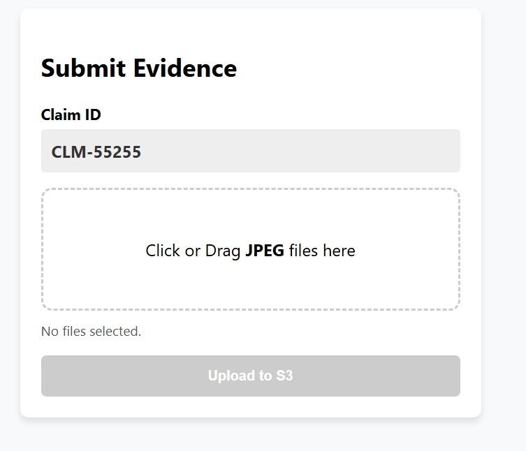

# S3 Document Upload Stack
### Cognigy xApp + AWS Pre-signed URL Backend

This repository provides a complete full-stack solution for securely uploading claim evidence (images/documents) through a **Cognigy xApp**. By utilizing **AWS Pre-signed URLs**, files are uploaded directly from the user's browser to an S3 bucket, ensuring high performance and security without exposing AWS credentials.

---

## 1. Solution Architecture
The workflow utilizes a secure "Request-Then-Upload" pattern:

1. **Request:** The Cognigy xApp calls the API Gateway to request a temporary upload URL.
2. **Sign:** An AWS Lambda function generates a cryptographically signed URL valid for 5 minutes.
3. **Upload:** The xApp performs an HTTP `PUT` request to upload the file directly to S3.
4. **Completion:** The xApp notifies the Cognigy Flow via `SDK.submit()`, allowing the conversation to continue.


---

## 2. Backend Components (CloudFormation)
The `template.yaml` file automates the deployment of the following AWS resources:

* **S3 Bucket:** `claim-docs-app-{account-id}`. Configured with a CORS policy to allow `PUT` requests.
* **Signer Lambda:** A Node.js 18.x function that generates secure, time-limited URLs.
* **API Gateway:** A REST API exposing the `/get-url` endpoint.
* **IAM Role:** Follows the principle of least privilege, granting only `s3:PutObject` access to the Lambda function.

---

## 3. Frontend Component (Cognigy xApp)
The HTML5 interface is optimized for mobile and desktop use within the Cognigy environment.

### Interface Preview


### Key Features
* **Security:** Restricts uploads to `image/jpeg`.
* **User Experience:** Drag-and-drop support, real-time progress bar, and file count validation.
* **Data Organization:** Files are automatically stored in S3 using the path: `{{claimId}}/{{timestamp}}-{{fileName}}`.

---

## 4. Deployment Instructions

### Step 1: AWS Backend Deployment
Deploy the stack using the AWS CLI:
```bash
aws cloudformation deploy \
  --template-file template.yaml \
  --stack-name claim-upload-backend \
  --capabilities CAPABILITY_IAM